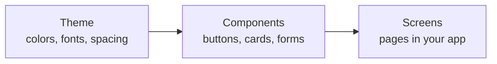
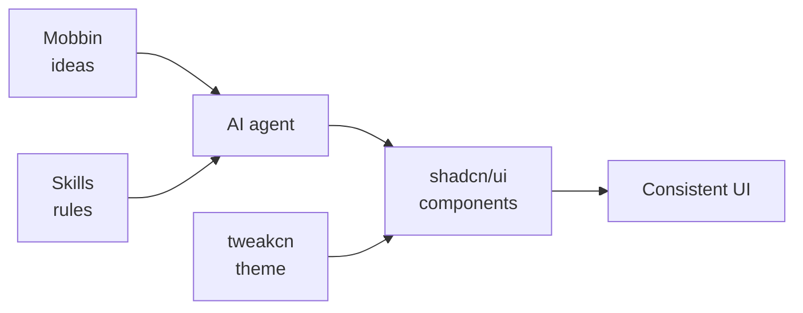
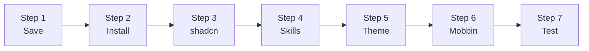
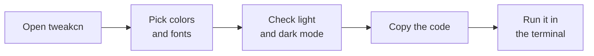

[← Back to all guides](../README.md)

# How to Build Consistent UI

## What is a design system?

A **design system** is one shared set of rules and building blocks for how an app looks and works: colors, fonts, spacing, buttons, forms, and so on. Instead of every screen being designed from scratch, everyone reuses the same pieces. That keeps the app **consistent**, and building it **faster**.



Change the theme once, and every component and screen updates with it.

---

## Why this flow?

- **Consistent:** every screen uses the same components and theme, so the app looks like one product, not many.
- **Faster:** you start from ready-made components instead of building buttons and forms from scratch.
- **Easy to restyle:** want new colors or fonts? Change the theme once and the whole app updates.
- **AI builds it right:** skills teach the AI your rules, so its code matches the design system instead of inventing its own styles.
- **Proven designs:** Mobbin shows how real apps solve the same screen, so you're not guessing.
- **Works everywhere:** the same steps work for new and existing projects, and with any AI agent.

---

## Tools

| Tool | What it does | Link |
| --- | --- | --- |
| **shadcn/ui** | Ready-made components (buttons, cards, menus, forms) | [ui.shadcn.com](https://ui.shadcn.com) |
| **tweakcn** | Configure the theme (colors, fonts, radius) with a live preview | [tweakcn.com](https://tweakcn.com) |
| **Skills** | Rule books that teach the AI to use our tools correctly | [skills.sh](https://skills.sh) |
| **Mobbin** | Screenshots of real apps, which the AI can search for design ideas | [mobbin.com](https://mobbin.com) |

**How they fit together:**



---

## Before you start

Install:

- **Node.js 20+**: [nodejs.org](https://nodejs.org) (the "LTS" version). Check it with `node -v`.
- **Git**: [git-scm.com](https://git-scm.com)
- **An AI coding agent** that supports skills and MCP

---

## Part A: Existing project



**1. Save your work** so you can undo later:

```bash
git add .
git commit -m "Before adding shadcn"
```

**2. Install** your project's packages:

```bash
npm install
```

> You need **Tailwind CSS** for the next steps. Look for `tailwindcss` in `package.json`. If it's not there, [install Tailwind](https://tailwindcss.com/docs/installation) first.

**3. Set up shadcn.** If your project has no `components.json` file, run this and choose **Base UI**, **Nova**, **Neutral**, and **Lucide**:

```bash
npx shadcn@latest init
```

Then add the components you need:

```bash
npx shadcn@latest add button card input
```

**4. Add the AI skills:**

```bash
npx skills add shadcn-ui/ui --skill shadcn
npx skills add vercel-labs/agent-skills --skill vercel-react-best-practices
npx skills add vercel-labs/agent-skills --skill web-design-guidelines
```

Save the new `.agents/skills` folder to Git so the team shares it.

**5. Add a theme:** see [Part C](#part-c-add-a-theme-tweakcn).

> If your project already has its own colors, check the app afterwards. If something went missing, undo with Git.

**6. Connect Mobbin** (optional, and you only need to do it once):
Add the Mobbin MCP server to your AI agent's MCP settings and sign in with your Mobbin account. See [mobbin.com](https://mobbin.com) for setup details.

**7. Test it.** Run `npm run dev`, open [localhost:3000](http://localhost:3000), and ask the AI:

> What shadcn components are installed in this project?

---

## Part B: New project

**1. Create the app:** go to [ui.shadcn.com/create](https://ui.shadcn.com/create), choose **Base UI**, **Nova**, **Neutral**, and **Lucide**, then run the command it gives you.

**2. Add the AI skills:** use the same 3 commands as in [Part A, step 4](#part-a-existing-project).

**3. Add a theme:** see [Part C](#part-c-add-a-theme-tweakcn).

---

## Part C: Add a theme (tweakcn)



1. Open the [tweakcn editor](https://tweakcn.com/editor/theme).
2. Pick a theme, or change the colors yourself.
3. Check it in **light and dark mode**.
4. Click **Code** and copy the `npx shadcn@latest add ...` command.
5. Paste it in the terminal and press Enter.

---

## Helpful links

- [shadcn components](https://ui.shadcn.com/docs/components) · [shadcn create](https://ui.shadcn.com/create) · [shadcn theming](https://ui.shadcn.com/docs/theming)
- [tweakcn editor](https://tweakcn.com/editor/theme) · [Skills directory](https://skills.sh) · [Mobbin](https://mobbin.com) · [What is MCP?](https://modelcontextprotocol.io)

---

[← Back to all guides](../README.md)
